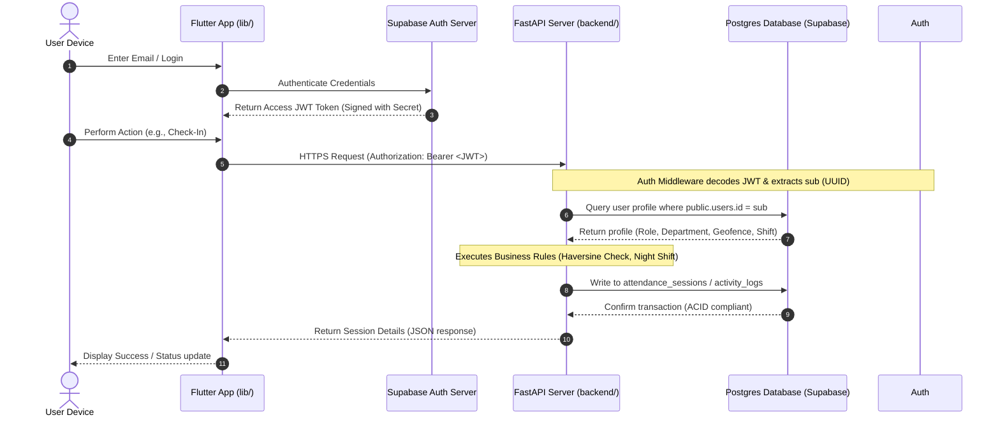

# AttendNova Technical Requirements Document (TRD)

This document outlines the technical design, integration architecture, security contracts, and API schemas for **AttendNova**, a real-time attendance and leave tracking system.

---

## 1. System Integration Architecture

AttendNova is split into three main components: a Flutter mobile application, an asynchronous FastAPI REST server, and a Supabase database instance.



---

## 2. Frontend (Flutter) Integration Design

The mobile frontend must manage local user state, coordinate with Supabase for user sessions, fetch device location data, and perform REST requests.

### Core Dependencies to Add to `pubspec.yaml`:
```yaml
dependencies:
  # Supabase Flutter SDK for Auth
  supabase_flutter: ^2.8.0
  # HTTP Client for FastAPI requests
  dio: ^5.5.0
  # Device location coordinates provider
  geolocator: ^12.0.0
```

### Authentication Lifecycle:
1.  **Login**: User logs in via standard email/password using `Supabase.instance.client.auth.signInWithPassword()`.
2.  **JWT Extraction**: The application retrieves the access token:
    ```dart
    final String? jwtToken = Supabase.instance.client.auth.currentSession?.accessToken;
    ```
3.  **Client Headers**: Every REST API call to our FastAPI server must attach this JWT to the header:
    ```text
    Authorization: Bearer <jwtToken>
    ```

---

## 3. Database Schema & Triggers (Supabase Postgres)

The backend interacts with 7 relational database tables mapped via SQLAlchemy.

### The Auth Sync Trigger Function
To ensure database integrity, we sync user sign-ups automatically from Supabase’s internal `auth.users` schema to our `public.users` schema using a PostgreSQL database trigger function:

```sql
CREATE OR REPLACE FUNCTION public.handle_new_user()
RETURNS TRIGGER AS $$
BEGIN
  INSERT INTO public.users (id, email, full_name, role, work_type, is_active)
  VALUES (
    new.id,
    new.email,
    COALESCE(new.raw_user_meta_data->>'full_name', 'Employee'),
    'EMPLOYEE', -- Default role
    'OFFICE',   -- Default work type
    true
  );
  RETURN new;
END;
$$ LANGUAGE plpgsql SECURITY DEFINER;

CREATE OR REPLACE TRIGGER on_auth_user_created
  AFTER INSERT ON auth.users
  FOR EACH ROW EXECUTE FUNCTION public.handle_new_user();
```

---

## 4. REST API Endpoints Contract

All request and response models are serialized as JSON. The API uses standard HTTP status codes:
*   `200 OK`: Successful operation.
*   `400 Bad Request`: Validation failure or business rule violation (e.g. double check-in).
*   `401 Unauthorized`: Invalid or expired JWT token.
*   `403 Forbidden`: Insufficient role or incorrect work type permissions.

### A. Read Current User Profile
*   **Path**: `GET /api/auth/me`
*   **Headers**: `Authorization: Bearer <token>`
*   **Response (200 OK)**:
    ```json
    {
      "email": "employee@example.com",
      "full_name": "John Doe",
      "phone": "1234567890",
      "role": "EMPLOYEE",
      "work_type": "OFFICE",
      "profile_photo_url": null,
      "id": "3fa85f64-5717-4562-b3fc-2c963f66afa6",
      "department_id": "84983c7c-af1b-4cf9-b921-2514055382e5",
      "manager_id": null,
      "shift_id": "d408ae68-7fbf-4257-b93b-66e7198f716c",
      "is_active": true,
      "created_at": "2026-06-07T05:00:00Z",
      "updated_at": "2026-06-07T05:00:00Z",
      "department": {
        "name": "Engineering",
        "location": "HQ Branch",
        "geofence_lat": 18.5204,
        "geofence_lng": 73.8567,
        "allowed_radius_meters": 100,
        "id": "84983c7c-af1b-4cf9-b921-2514055382e5",
        "created_at": "2026-06-07T04:00:00Z"
      },
      "shift": {
        "name": "Day Shift",
        "start_time": "09:00:00",
        "end_time": "17:00:00",
        "grace_period_minutes": 15,
        "id": "d408ae68-7fbf-4257-b93b-66e7198f716c",
        "created_at": "2026-06-07T04:00:00Z"
      }
    }
    ```

### B. Check-In Endpoint
*   **Path**: `POST /api/attendance/check-in`
*   **Request Body**:
    ```json
    {
      "latitude": 18.5204,
      "longitude": 73.8567,
      "location_name": "HQ Gate"
    }
    ```
*   **Response (200 OK)**:
    ```json
    {
      "id": "2c963f66-5717-4562-b3fc-2c963f66afa6",
      "user_id": "3fa85f64-5717-4562-b3fc-2c963f66afa6",
      "shift_id": "d408ae68-7fbf-4257-b93b-66e7198f716c",
      "shift_date": "2026-06-07",
      "clock_in": "2026-06-07T09:05:00Z",
      "clock_out": null,
      "total_hours": null,
      "status": "PRESENT",
      "is_out_of_bounds": false,
      "verification_status": "APPROVED",
      "created_at": "2026-06-07T09:05:00Z",
      "activity_logs": []
    }
    ```

### C. Toggle Timeline Activity Logs (Field Staff Only)
*   **Path**: `POST /api/attendance/activity`
*   **Request Body**:
    ```json
    {
      "activity_type": "MEETING",
      "latitude": 18.5250,
      "longitude": 73.8600,
      "location_name": "Client Site B",
      "notes": "Weekly review meeting"
    }
    ```
*   **Response (200 OK)**:
    ```json
    {
      "id": "b3fc2c96-5717-4562-b3fc-2c963f66afa6",
      "session_id": "2c963f66-5717-4562-b3fc-2c963f66afa6",
      "activity_type": "MEETING",
      "start_time": "2026-06-07T11:30:00Z",
      "end_time": null,
      "latitude": 18.525,
      "longitude": 73.86,
      "location_name": "Client Site B",
      "notes": "Weekly review meeting"
    }
    ```

---

## 5. Security & Deployment Architecture

### A. Environment Configuration (`.env`)
Environment settings are isolated and loaded via `python-dotenv`.
*   `DATABASE_URL`: Must connect to the **Session Pooler** endpoint (port `6543`) rather than the direct port (`5432`) to withstand concurrent traffic spikes from cell phones.
*   `SUPABASE_JWT_SECRET`: HS256 secret key. Never commit this to Git repositories.

### B. CORS Settings (`ALLOWED_ORIGINS`)
For security, when publishing the backend, set `ALLOWED_ORIGINS` to the exact domain origin of your mobile application endpoints (or keep it `*` if you want open endpoints for test builds).
