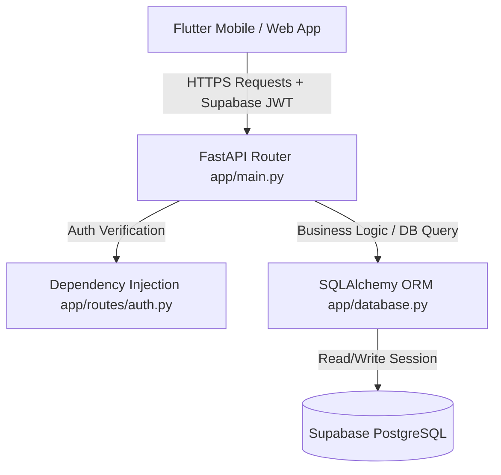

# AttendNova Backend Architecture & Implementation Guide

This directory contains the comprehensive documentation of the **AttendNova REST API Backend**. This backend is built using **FastAPI** and **SQLAlchemy 2.0** to handle real-time attendance tracking, automated geofencing, multi-role employee permissions, and active tracking for field workers.

---

## 1. Architectural Blueprint & Technical Stack

The backend uses a layered architecture designed for speed, type-safety, and direct integration with Supabase PostgreSQL:



### Technical Decisions:
*   **FastAPI**: Selected for its asynchronous capabilities (which handle high-concurrency requests easily), native support for type checking, and automatic documentation generation (Swagger UI at `/docs`).
*   **SQLAlchemy 2.0 (ORM)**: Decouples the database implementation from the Python code. Models are defined as Python classes, allowing us to query and modify records safely without writing raw SQL.
*   **PyJWT**: Used to decode and verify JSON Web Tokens (JWT) signed by Supabase Auth, making sure only authenticated users can access the system.
*   **Pydantic V2**: Handles all request validation and response serialization. It acts as a gatekeeper, returning standard `422 Unprocessable Entity` errors if coordinates or fields are invalid.

---

## 2. Directory Structure

The backend workspace is laid out as follows:

```
backend/
├── app/
│   ├── routes/
│   │   ├── __init__.py
│   │   ├── auth.py          # Decodes Supabase JWTs & fetches matching profiles
│   │   └── attendance.py    # Check-in, check-out, geofencing, and activity timelines
│   ├── __init__.py
│   ├── config.py            # Loads and validates environment variables
│   ├── database.py          # Creates SQLAlchemy engine and SessionLocal dependency
│   ├── main.py              # Application entrypoint & CORS middleware
│   ├── models.py            # Database tables mapped to Python ORM classes
│   └── schemas.py           # Pydantic models for request & response validation
├── tests/
│   ├── __init__.py
│   └── test_attendance.py   # Unit test suite using SQLite in-memory and mock auth
├── .env.example             # Template for configuration keys
├── generate_test_token.py   # Utility script to sign custom test JWTs
└── requirements.txt         # Package dependencies list
```

---

## 3. List of Documents in this Guide:

For a deep dive into specific aspects of the backend, refer to the following files:
1. **[file_mappings.md](file:///d:/NOVA/flutter_st/attendnova_3/till-now/backend/file_mappings.md)**: A detailed breakdown of every single file in the backend codebase, explaining its imports, methods, and responsibilities.
2. **[business_rules.md](file:///d:/NOVA/flutter_st/attendnova_3/till-now/backend/business_rules.md)**: A complete explanation of the geofencing math, night-shift logic, and timeline activity state machine.
3. **[testing_guide.md](file:///d:/NOVA/flutter_st/attendnova_3/till-now/backend/testing_guide.md)**: An explanation of how our testing suite is built using mock injection and how to run validation checks.
