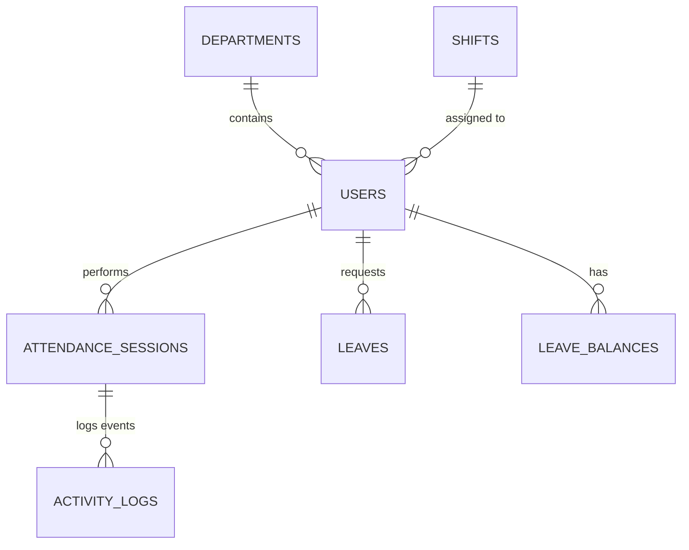

# AttendNova Database Design Documentation

This document describes the production-grade database schema for **AttendNova**, a real-time attendance and leave tracking system. It incorporates granular activity logs for on-field staff (using timeline toggles) and conditional geofencing checks with out-of-bounds flagging for office-based staff.

---

## 1. Architectural Decisions & Logic ("The Why and Where")

When building this database, we resolved several system loopholes with specific table relationships:

### A. Auth Isolation & Security (Supabase auth.users -> public.users)
*   **The Decision:** We do not store password hashes or security credentials in the `public.users` table. Instead, `public.users.id` links directly to Supabase's secure `auth.users.id` (1:1 relation).
*   **The Logic:** This prevents database leaks of password hashes and offloads MFA, session token generation, and password resets to Supabase’s audited authentication system.

### B. Geofencing Toggles vs. Hard Blocks (Office Workers)
*   **The Decision:** We added `is_out_of_bounds` (BOOLEAN) and `verification_status` to `attendance_sessions`.
*   **The Logic:** Hard-blocking office workers from checking in if they are >100m away causes issues with phone GPS drift and working from home or client sites. Allowing them to check in but marking their status as `PENDING_APPROVAL` with an `is_out_of_bounds` flag gives operational flexibility while requiring manager approval for payroll.

### C. Granular Activity Timelines vs. Flat Columns (On-Field Workers)
*   **The Decision:** We created the child table `activity_logs` linked to `attendance_sessions` to log state transitions (`TRAVEL`, `MEETING`, `WORK`, `BREAK`).
*   **The Logic:** Flat columns (e.g. `total_travel_hours` or `meeting_1_gps`) are limited and easy to falsify. A child table allows field workers to toggle activities dynamically (unlimited client meetings), records coordinates *at the moment of transition* for auditing, and builds a chronological timeline.

### D. Leave Balance Cache vs. On-the-Fly Scanning
*   **The Decision:** We created the `leave_balances` ledger table.
*   **The Logic:** Scanning all past leaves from day one to calculate an employee's remaining balance is expensive and gets slower over time. Storing calculated allocations, used days, and pending days in a separate ledger ensures instant queries.

### E. Shift Dates vs. Calendar Dates (Night Shifts)
*   **The Decision:** We use `shift_date` on the `attendance_sessions` table and link sessions to a `shift_id`.
*   **The Logic:** Night shifts span across midnight (e.g. clock-in Monday 10 PM, clock-out Tuesday 6 AM). If we keyed off the calendar check-in date, a worker checking out on Tuesday would face key violations or logic errors when trying to clock back in for Tuesday night. Assigning a logical `shift_date` (the start date of the shift) solves this boundary issue.

---

## 2. Database Architecture & ER Diagram

AttendNova uses **PostgreSQL** (hosted via Supabase) to ensure transactional reliability, ACID compliance, and secure role-based controls.



## 3. Table ID Roles & Relationships

Every table in AttendNova uses a **UUID** (Universally Unique Identifier) as its primary key (`id`). Below is an explanation of what each table's ID represents and how they link the system together:

*   **`departments.id` (UUID, Primary Key):** Uniquely identifies a department or office branch.
    *   *Relation:* Referenced by `users.department_id` to link employees to their departments for location geofencing.
*   **`shifts.id` (UUID, Primary Key):** Uniquely identifies a specific work schedule (e.g. Day Shift vs. Night Shift).
    *   *Relation:* Referenced by `users.shift_id` to assign shifts to employees, and by `attendance_sessions.shift_id` to log which schedule was worked.
*   **`users.id` (UUID, Primary Key):** **Crucial Security Link.** It is not auto-generated; instead, it explicitly references Supabase's internal `auth.users(id)`. This creates a 1:1 mapping between the authenticated login credentials and the public profile details.
    *   *Relation:* Self-references as `users.manager_id` to build the corporate hierarchy. Referenced by `attendance_sessions.user_id`, `leaves.user_id`, and `leave_balances.user_id` to track all employee events.
*   **`leave_balances.id` (UUID, Primary Key):** Uniquely identifies a balance record mapping an allocation (e.g., "12 Sick Leave days for Sarah Field in 2026").
*   **`attendance_sessions.id` (UUID, Primary Key):** Uniquely identifies a single workday check-in session.
    *   *Relation:* Referenced by `activity_logs.session_id` to group all of a field worker's daily travels and meetings under one parent shift.
*   **`activity_logs.id` (UUID, Primary Key):** Uniquely identifies a specific activity log (e.g., a Client Meeting event from 10:00 AM to 11:30 AM).
*   **`leaves.id` (UUID, Primary Key):** Uniquely identifies a specific leave application.

---

## 4. DDL Table Schema Scripts

Run these scripts in your Supabase SQL Editor to initialize the database tables, triggers, and indices:

```sql
-- =========================================================================
-- 1. DEPARTMENTS TABLE
-- =========================================================================
CREATE TABLE departments (
    id UUID DEFAULT gen_random_uuid() PRIMARY KEY,
    name VARCHAR(100) NOT NULL UNIQUE,
    location VARCHAR(255),
    geofence_lat DECIMAL(9,6),        -- Latitude of the office location
    geofence_lng DECIMAL(9,6),        -- Longitude of the office location
    allowed_radius_meters INT DEFAULT 100, -- Maximum distance allowed for normal check-in
    created_at TIMESTAMP WITH TIME ZONE DEFAULT now() NOT NULL
);

-- =========================================================================
-- 2. SHIFTS TABLE
-- =========================================================================
CREATE TABLE shifts (
    id UUID DEFAULT gen_random_uuid() PRIMARY KEY,
    name VARCHAR(100) NOT NULL,       -- e.g., "Day Shift", "Night Shift"
    start_time TIME NOT NULL,         -- e.g., '09:00:00'
    end_time TIME NOT NULL,           -- e.g., '17:00:00'
    grace_period_minutes INT DEFAULT 15,
    created_at TIMESTAMP WITH TIME ZONE DEFAULT now() NOT NULL
);

-- =========================================================================
-- 3. USERS PROFILE TABLE
-- =========================================================================
-- Note: This table references Supabase's secure auth schema (auth.users).
-- It does not store passwords; Supabase handles authentication.
CREATE TABLE users (
    id UUID REFERENCES auth.users(id) ON DELETE CASCADE PRIMARY KEY,
    email VARCHAR(255) UNIQUE NOT NULL,
    full_name VARCHAR(150) NOT NULL,
    phone VARCHAR(20),
    role VARCHAR(50) NOT NULL CHECK (role IN ('ADMIN', 'MANAGER', 'EMPLOYEE')),
    work_type VARCHAR(50) NOT NULL CHECK (work_type IN ('FIELD', 'OFFICE')),
    department_id UUID REFERENCES departments(id) ON DELETE SET NULL,
    manager_id UUID REFERENCES users(id) ON DELETE SET NULL,
    shift_id UUID REFERENCES shifts(id) ON DELETE SET NULL,
    profile_photo_url TEXT,
    is_active BOOLEAN DEFAULT true NOT NULL,
    deleted_at TIMESTAMP WITH TIME ZONE,
    created_at TIMESTAMP WITH TIME ZONE DEFAULT now() NOT NULL,
    updated_at TIMESTAMP WITH TIME ZONE DEFAULT now() NOT NULL
);

-- =========================================================================
-- 4. LEAVE BALANCES TABLE
-- =========================================================================
CREATE TABLE leave_balances (
    id UUID DEFAULT gen_random_uuid() PRIMARY KEY,
    user_id UUID REFERENCES users(id) ON DELETE CASCADE NOT NULL,
    year INT NOT NULL,
    leave_type VARCHAR(50) NOT NULL CHECK (leave_type IN ('SICK', 'CASUAL', 'ANNUAL')),
    total_days INT NOT NULL,
    used_days INT DEFAULT 0 NOT NULL,
    pending_days INT DEFAULT 0 NOT NULL,
    UNIQUE(user_id, year, leave_type)
);

-- =========================================================================
-- 5. ATTENDANCE SESSIONS TABLE
-- =========================================================================
CREATE TABLE attendance_sessions (
    id UUID DEFAULT gen_random_uuid() PRIMARY KEY,
    user_id UUID REFERENCES users(id) ON DELETE CASCADE NOT NULL,
    shift_id UUID REFERENCES shifts(id) NOT NULL,
    shift_date DATE NOT NULL,
    clock_in TIMESTAMP WITH TIME ZONE NOT NULL,
    clock_out TIMESTAMP WITH TIME ZONE,
    total_hours NUMERIC(4,2),
    status VARCHAR(50) DEFAULT 'PRESENT' CHECK (status IN ('PRESENT', 'HALF_DAY', 'ABSENT')),
    is_out_of_bounds BOOLEAN DEFAULT false NOT NULL, -- True if checked in outside geofence (office workers)
    verification_status VARCHAR(50) DEFAULT 'APPROVED' CHECK (verification_status IN ('APPROVED', 'PENDING_APPROVAL', 'REJECTED')),
    created_at TIMESTAMP WITH TIME ZONE DEFAULT now() NOT NULL,
    UNIQUE(user_id, shift_date)
);

-- =========================================================================
-- 6. ACTIVITY LOGS TABLE (Option B: Field Worker Activity Timelines)
-- =========================================================================
CREATE TABLE activity_logs (
    id UUID DEFAULT gen_random_uuid() PRIMARY KEY,
    session_id UUID REFERENCES attendance_sessions(id) ON DELETE CASCADE NOT NULL,
    activity_type VARCHAR(50) NOT NULL CHECK (activity_type IN ('TRAVEL', 'MEETING', 'WORK', 'BREAK')),
    start_time TIMESTAMP WITH TIME ZONE NOT NULL,
    end_time TIMESTAMP WITH TIME ZONE,
    latitude DECIMAL(9,6) NOT NULL,
    longitude DECIMAL(9,6) NOT NULL,
    location_name VARCHAR(255),
    notes TEXT
);

-- =========================================================================
-- 7. LEAVE APPLICATIONS TABLE
-- =========================================================================
CREATE TABLE leaves (
    id UUID DEFAULT gen_random_uuid() PRIMARY KEY,
    user_id UUID REFERENCES users(id) ON DELETE CASCADE NOT NULL,
    leave_type VARCHAR(50) NOT NULL CHECK (leave_type IN ('SICK', 'CASUAL', 'ANNUAL')),
    start_date DATE NOT NULL,
    end_date DATE NOT NULL,
    total_days INT NOT NULL,
    reason TEXT NOT NULL,
    attachment_url TEXT,
    status VARCHAR(50) DEFAULT 'PENDING' CHECK (status IN ('PENDING', 'APPROVED', 'REJECTED')),
    approved_by UUID REFERENCES users(id) ON DELETE SET NULL,
    manager_comments TEXT,
    created_at TIMESTAMP WITH TIME ZONE DEFAULT now() NOT NULL
);
```

---

## 5. Triggers & Performance Tuning (Indexing)

### 5.1 Auto-Updating Modified Timestamps
To ensure records reflect exact modification times automatically, run this function and trigger:

```sql
CREATE OR REPLACE FUNCTION update_updated_at_column()
RETURNS TRIGGER AS $$
BEGIN
    NEW.updated_at = now();
    RETURN NEW;
END;
$$ language 'plpgsql';

CREATE TRIGGER update_users_updated_at 
BEFORE UPDATE ON users 
FOR EACH ROW EXECUTE PROCEDURE update_updated_at_column();
```

### 5.2 Performance Indexing
High-traffic columns are indexed to guarantee swift query execution as the database size increases:

```sql
-- Fast lookup during login queries
CREATE INDEX idx_users_email ON users(email);

-- Fast lookup of employee balances for current year
CREATE INDEX idx_leave_balances_lookup ON leave_balances(user_id, year);

-- Instantly rendering calendar screens and list views
CREATE INDEX idx_attendance_sessions_date ON attendance_sessions(user_id, shift_date);

-- Fast timeline reconstructions for field visits
CREATE INDEX idx_activity_logs_session ON activity_logs(session_id);
```

---

## 6. Operational Workflows & Edge Cases

### 6.1 In-Office Workers (Geofencing and Flagging)
When an `OFFICE` employee check-in occurs:
1. The backend API checks `users.work_type`.
2. It fetches the parent `departments.geofence_lat/lng` and `allowed_radius_meters`.
3. It computes the Haversine distance between check-in coordinates and office coordinates.
4. **If distance > radius:** The check-in is saved, but `is_out_of_bounds` is set to `true`, and `verification_status` is marked as `'PENDING_APPROVAL'`. The session does not count as approved until a manager logs in and approves it.

### 6.2 On-Field Workers (Activity Toggles)
When a `FIELD` employee check-in occurs:
1. The backend API bypasses the geofencing check entirely.
2. It initializes the main `attendance_sessions` row.
3. It creates the first `activity_logs` entry with `activity_type = 'TRAVEL'`.
4. As the employee moves throughout the day, the UI sends update payloads. Each toggle ends the previous activity (writes `end_time`) and begins a new activity (writes `start_time` and current location coordinates).
